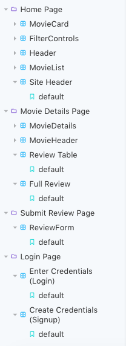
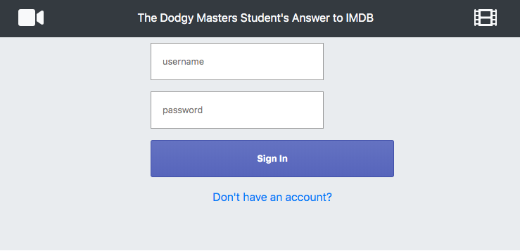
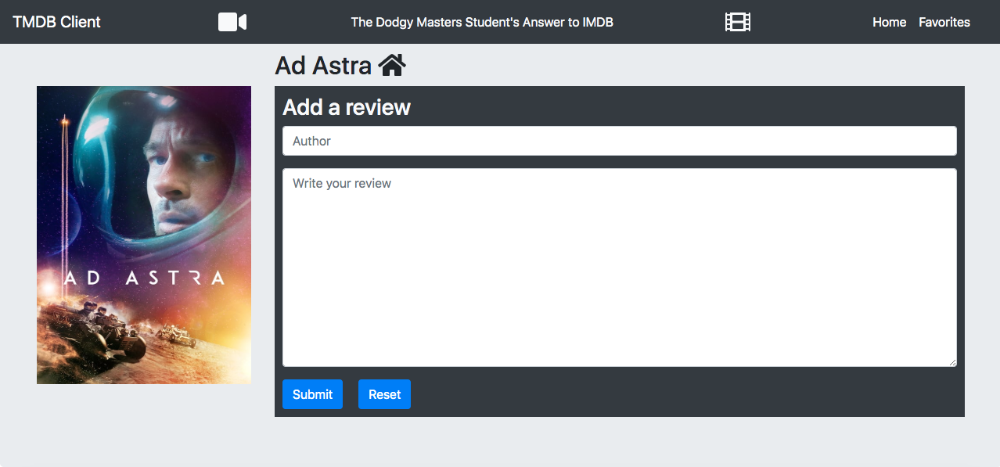

# Assignment 1 - ReactJS app.

Name: Kevin Grimes

## Overview.
The Movies Fan app allows users to browse a database of movie releases, view details about the production of specific movies, mark favourite movies read and write reviews. Users have the ability to log in using valid credentials or register their own credentials for access. None of the app is accessible without valid authentication, which is handled using JSON Web Tokens (JWTs) in the back-end using the express API application linked below.

For development purposes there are 2 hardcoded users seeded into the API from launch with username - password credentials:

user1 - test1 <br>
user2 - test2

## Setup requirements.

API server application repo: https://github.com/kevingrimestramore/ewd2020assignment2

In order to run the application installation of Node and Node Package Manager (npm) is required (https://nodejs.org/en/download/).

App was developed using:
Node v12.14.1
npm  v6.13.4

Either download the app using the ZIP download button above and unzip the file in a location of your choice; Or to install using git, open a terminal window in the folder you would lke to install the application within and run the following command:

```bat
git clone https://github.com/kevingrimestramore/ewd2020assignment1.git
```
(After intialising the server application from the repo linked above by following instructions in README)
Open a terminal window within the root directory of the application and run the following two commands in order:

```bat
npm install
npm start
```

Once npm is initialised within the app the already populated package.json file's dependencies will be used, so no further installation should be required.

You will need to create a Movie DB account (https://www.themoviedb.org/) and acquire an authentication key to access the TMDB API. Create a .env file in the source folder for the app and copy in your unique authentication key as shown below:

```bat
TMDB_KEY=[INSERT_TMDB_KEY_HERE]
```

## App Design.

## Component catalogue.

Screenshot of component catalogue attached, all relevent imports present, some storybook components unfinished.



New Storybook Components (expanded in image):

+ Site Header
+ Review Table
+ Full Review
+ Review Form
+ Enter Login Credentials
+ Create Login Credentials

## Design patterns.

authContext is used to pass the useAuth prop to most pages of the application in order to prevent unauthorized access and alows for the development of protected routing.

## UI Design.
New Views: <br>

>A signin (and signup) page t allow users to input credentials for authorization.


>A page which allows users to write a review for movies marked as a favourite.

A reviews excerpt table and a full review display is implemented into the Movie Details Page but cannot be accessed due to an issue discussed at the end of this document.

## Routing.
+ / (root path)     %  - Home page displaying movie list
+ /login               - Allow a user to enter login credentials for authentication
+ /signup              - Allow a user to create login credentials for authentication
+ /movies/:id       %  - Detailed view of specific movie by id with option to expand table showing review excerpts
+ /:id/reviews      %  - Shortlist view of reviews for movie by id
+ /reviews/form     %  - Form to add a review for a movie
+ /movies/favorites %  - List of a users selected favourite movies


NOTE: % indicates routes which are protected and require authentication. Attempting to access these routes without a valid JSON Web Token will result in the user being redirected to the login page where they can  create or use existing login credentials to gain access.

## Known issues.
+ When viewing the details of a specific movie (/movies/:id) and clicking the "show reviews" button, the route is changed (/:id/reviews) and the table outline is displayed, but no review data is received to be displayed. This indicates an issue between movieDetailsPage and the movieReviews component. Attempted to resolve but couldn't find a solution. This error prevents access to the controls to view the full reviews for a movie although the logic to display the full review page is implemented.
+ Certain movies when selected from the home page display an error and prevent the page from rendering. Seems to be an error with the movieDetailsPage. At the time of writing, Scary Movie 6 - ID: 668203 (When application is running - http://localhost:3000/movies/668203) presents this issue.
